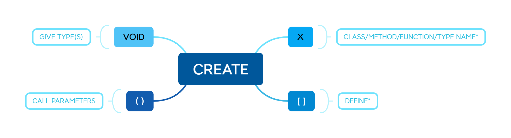
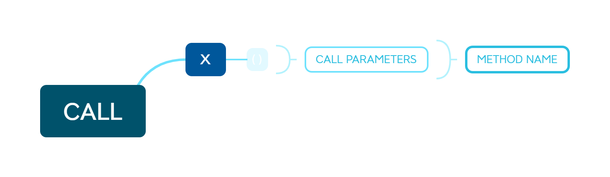
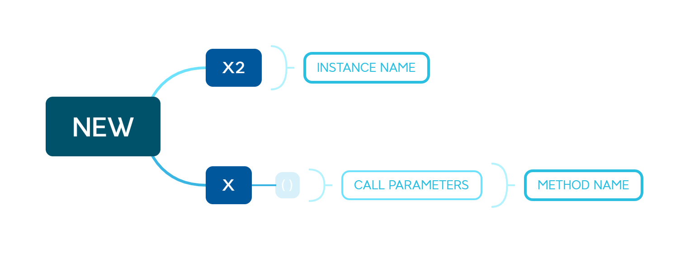
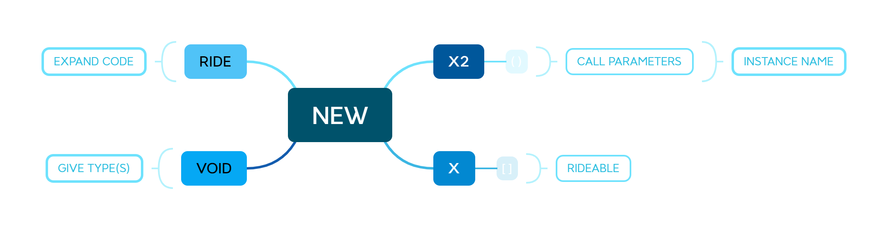

**CREATE A Function**

Type/Class/Method/Function: are implemented in First Letter Capitalized yet you can use all caps if you want. 
````
    VOID CREATE X()[
        DISPLAY[Greeting]
    ]
````



**Call A Function**

CALL: EXECUTE/USE/GET/SET
````    
    CALL X()
````



**CREATE an Instance of a... Class**

NEW: To implement a NEW instance of a class, you must use the NEW keyword.  In this example NEW will create a new instance of the "X" class and name it "X2". 
````
    NEW X2 X()
````



**RIDE and CREATE an Instance of... Class with Parameters**

 You can also use the RIDE keyword to create a new instance of a class that implements the RIDEABLE interface.  This will allow you to create a new instance of a class that implements the RIDEABLE interface for overwriting classes a type of INHERITANCE/POLYMORPHISM paradigm.

*Convention: Parameters All-Lower case.*

````
    RIDE NEW X2 X(STRING string, INTEGER int)[
        DISPLAY[string]
        DISPLAY[int] **Convention: Pass variable ARGUMENTS
    ]
````



**GRAB to ITERARATE through an INDEX**
 
 ````
    GRAB Greeting IN Greetings[
        DISPLAY[Greeting]
    ]
````

    #Prints "Hello!"
    #Prints "Hey"
    #Prints "Hi"